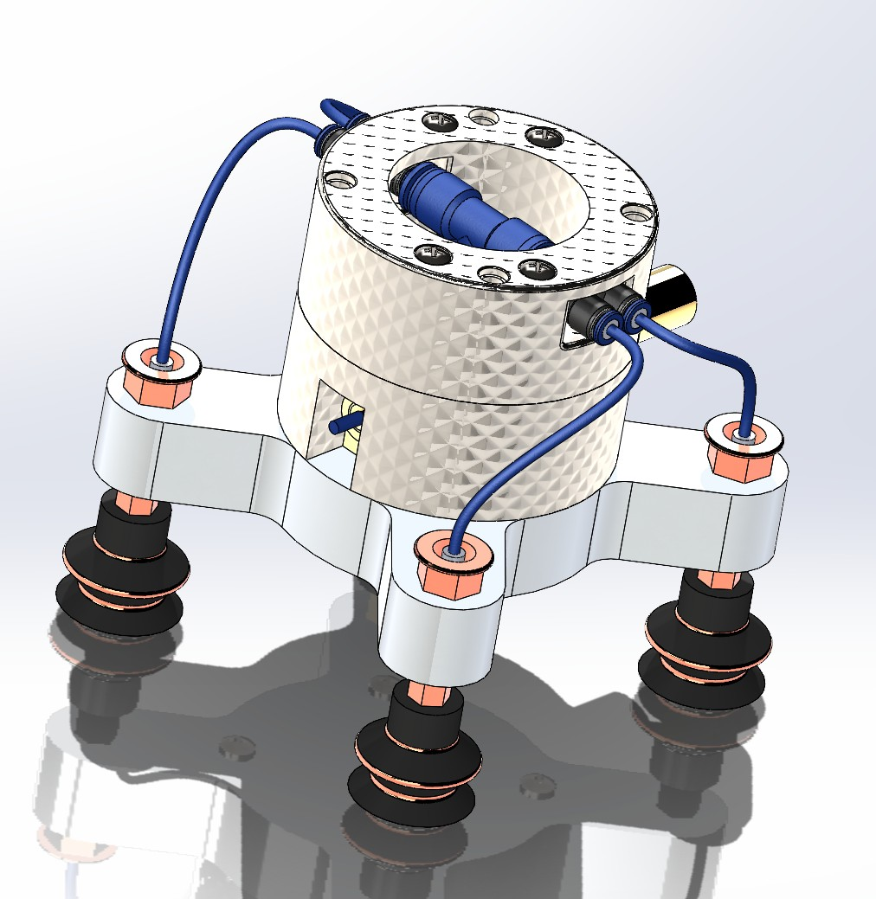
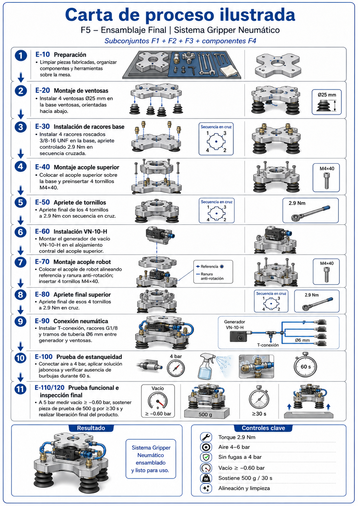

# Pneumatic Vacuum Gripper for Robotic Arm

Modular vacuum gripper for the **CRP-RA09A-07** robotic arm, driven by a **FESTO VN-10-H** venturi generator with four Ø25 mm bellows suction cups in a cross layout. It handles flat parts up to **500 g** at an operating vacuum of **≥ −0.60 bar**, with real-time vacuum monitoring by an **ESP32** and an **MPX5700** sensor.

Final project (Phase 4) for *Mechanical Design – Methodical Design*, Department of Mechanical Engineering, **Universidad EAFIT** (Medellín, Colombia), May 2026.

<p align="center">
  
</p>
<p align="center"><em>SolidWorks assembly: robot coupling, suction cup base, VN-10-H venturi and four Ø25 mm bellows suction cups.</em></p>

---

## Features

- **Structure:** three machined parts in 6061-T6 aluminum (suction cup base, upper coupling, robot coupling), ±0.1 mm tolerance, Ra 3.2 µm surface finish
- **Pneumatics:** FESTO VN-10-H venturi, 4–6 bar supply, 4 × Ø25 mm bellows suction cups, Ø6 mm tubing, T-connector and G1/8 fittings
- **Electronics:** ESP32, MPX5700 vacuum sensor, PNP vacuum switch set to −0.60 bar, LM2596 / AMS1117 regulators
- **Documentation:** 7 illustrated process charts (F1–F7) following ISO 9001:2015 clause 8.5.1, a QFD matrix, a validation plan and a cost analysis

## Test results

All six KPIs passed. Each was measured over at least 10 cycles.

| KPI | Target | Result |
|---|---|---|
| Grip force | ≥ 5 N | **6.2 N** ✅ |
| Positioning accuracy | ≤ 0.5 mm | **0.3 mm** ✅ |
| Repeatability (30 cycles at 5 bar) | ≥ 95 % | **96.7 %** ✅ |
| Response time | ≤ 0.5 s | **0.38 s** ✅ |
| Load capacity | 500 g for ≥ 30 s | **500 g for 36 s** ✅ |
| Operating vacuum | ≥ −0.60 bar | **−0.63 bar** ✅ |

The system also passed a leak test at 4 bar for 60 s with no bubbles.

## Cost

The best scenario (supplier C, using an existing air line) costs **$1,113,170 COP**. That is **34.6 % less** than the original baseline of $1,701,700 COP, with an estimated gross margin of 44.4 %. Details are in [`05_Spreadsheets/Costs`](05_Spreadsheets/Costs).

## Repository structure

```
01_CAD/
  SolidWorks_Assembly/      SolidWorks parts (.SLDPRT) and assemblies (.SLDASM)
  3D_Print_STL/             STL files ready for 3D printing
02_Documentation/           Final report (PDF) and design Q&A
03_Presentations/           PowerPoint and web (HTML) presentations
04_Process_Charts/          Illustrated manufacturing process charts F1–F7
05_Spreadsheets/            QFD, process chart, validation plan
  Costs/                    Cost and feasibility analysis
docs/images/                README images (assembly render)
_duplicates/                Duplicate copies kept for reference
```

## Manufacturing process charts



| Chart | Part / stage | Setup (min) | Cycle (min) |
|---|---|---|---|
| [F1](04_Process_Charts/F1_Suction_Cup_Base.png) | Suction cup base – Al 6061-T6 | 90 | 210 |
| [F2](04_Process_Charts/F2_Upper_Coupling.png) | Upper coupling – Al 6061-T6 | 100 | 185 |
| [F3](04_Process_Charts/F3_Robot_Coupling.png) | Robot coupling – Al 6061-T6 | 85 | 145 |
| [F4](04_Process_Charts/F4_Commercial_Components.png) | Commercial components (receiving and prep) | — | — |
| [F5](04_Process_Charts/F5_Final_Assembly.png) | Final assembly and tests | 45 | 110 |
| [F6](04_Process_Charts/F6_Electrical_Assembly.html) | Electrical assembly | 75 | 125 |
| [F7](04_Process_Charts/F7_Pneumatic_Assembly.html) | Pneumatic assembly | — | — |
| | **Total** | **395** | **775** |

## Opening the CAD files

Open `01_CAD/SolidWorks_Assembly/Emsamblaje.SLDASM` in SolidWorks. Keep every part in the same folder so the assembly finds its references. The part files keep their original Spanish names so those references don't break.

## Team — Group 6

- Daniel Ruiz Sandoval
- David Zuluaga Henao
- Santiago Quintero Álvarez
- Julián Guerrero
- Ernesto Enríquez

**Professor:** Ronald Mauricio Martinod Restrepo
